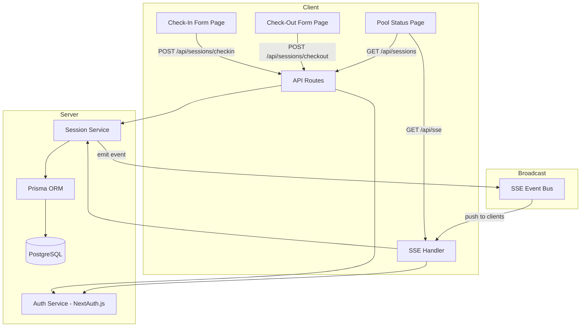
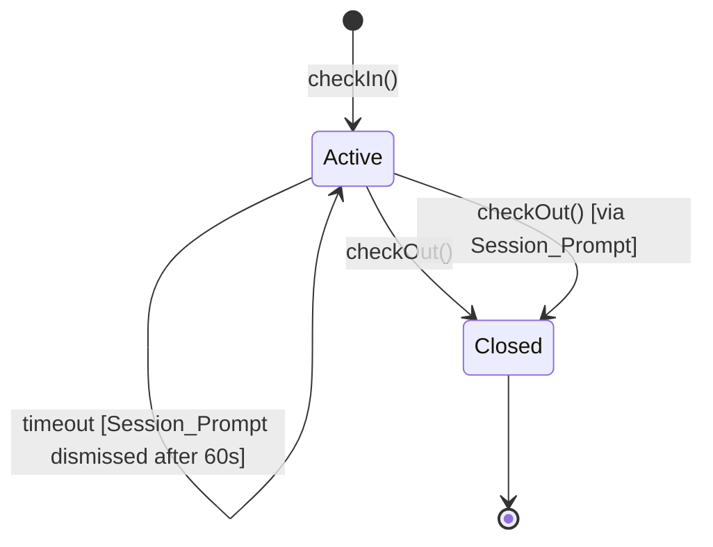

# Design Document: Pool Management App

## Overview

The Pool Management App is a Next.js (App Router) web application that manages member check-ins and check-outs at a pool facility. It provides real-time occupancy tracking via Server-Sent Events, role-based visibility through NextAuth.js, and durable session persistence via Prisma ORM on PostgreSQL.

The application has three primary surfaces:
1. **Check-In / Check-Out Form** — a public-facing page where members register arrivals and departures.
2. **Pool Status Page** — a real-time display of current occupancy and active sessions, with role-filtered data.
3. **Admin/Staff View** — the same Status Page with elevated data visibility (private sessions + phone numbers).

---

## Architecture

The application follows Next.js App Router conventions with a clear separation between server components, client components, API route handlers, and a shared service layer.



### Key Architectural Decisions

- **App Router with Server Actions / Route Handlers**: Form submissions use Next.js API Route Handlers (`/api/sessions/checkin`, `/api/sessions/checkout`) to keep validation and persistence server-side.
- **SSE over WebSockets**: Server-Sent Events are simpler to implement in Next.js App Router and sufficient for unidirectional push (server → client). An in-process event emitter acts as the broadcast bus.
- **Role resolution at the API boundary**: Every API route and SSE handler resolves the caller's role from the NextAuth session before returning data. This ensures role filtering is never bypassed.
- **Prisma as the single database interface**: All reads and writes go through Prisma, ensuring type safety and consistent query patterns.

---

## Components and Interfaces

### Page Components

| Route | Component | Description |
|---|---|---|
| `/` | `CheckInPage` | Check-in form; detects returning members |
| `/checkout` | `CheckOutPage` | Check-out form |
| `/status` | `StatusPage` | Real-time pool status; role-filtered |
| `/api/auth/[...nextauth]` | NextAuth handler | Authentication endpoints |
| `/api/sessions/checkin` | `POST` handler | Creates a new session |
| `/api/sessions/checkout` | `POST` handler | Closes an active session |
| `/api/sessions` | `GET` handler | Returns current sessions (role-filtered) |
| `/api/sse` | `GET` handler | SSE stream for real-time updates |

### Service Layer

#### `SessionService`

```typescript
interface SessionService {
  checkIn(data: CheckInInput): Promise<Session>;
  checkOut(membershipNumber: string): Promise<CheckOutResult>;
  findActiveSession(membershipNumber: string): Promise<Session | null>;
  getActiveSessions(role: UserRole): Promise<SessionView[]>;
}
```

#### `ValidationService`

```typescript
interface ValidationService {
  validateCheckIn(data: unknown): CheckInInput | ValidationError[];
  validateCheckOut(data: unknown): CheckOutInput | ValidationError[];
}
```

#### `SSEBroadcaster`

```typescript
interface SSEBroadcaster {
  subscribe(clientId: string, role: UserRole, writer: WritableStreamDefaultWriter): void;
  unsubscribe(clientId: string): void;
  broadcast(event: PoolStatusEvent): void;
}
```

### Data Transfer Objects

```typescript
interface CheckInInput {
  name: string;
  membershipNumber: string;  // numeric string
  phoneNumber: string;       // exactly 10 digits
  partySize: number;         // 1–20 inclusive
  isPrivate: boolean;
}

interface CheckOutInput {
  membershipNumber: string;
}

interface CheckOutResult {
  status: 'checked_out' | 'not_found';
  message: string;
}

interface SessionView {
  id: string;
  name: string;
  membershipNumber: string;
  phoneNumber?: string;      // only for Admin/Staff
  partySize: number;
  isPrivate: boolean;
  checkedInAt: Date;
}

interface PoolStatusEvent {
  totalOccupancy: number;
  sessions: SessionView[];   // role-filtered by broadcaster per client
  timestamp: Date;
}

type UserRole = 'admin' | 'staff' | 'public';
```

---

## Data Models

### Prisma Schema

```prisma
model Session {
  id               String    @id @default(cuid())
  name             String
  membershipNumber String
  phoneNumber      String
  partySize        Int
  isPrivate        Boolean   @default(false)
  checkedInAt      DateTime  @default(now())
  checkedOutAt     DateTime?
  isActive         Boolean   @default(true)

  @@index([membershipNumber, isActive])
  @@index([isActive])
}

model User {
  id            String    @id @default(cuid())
  email         String    @unique
  name          String?
  role          UserRole  @default(PUBLIC)
  createdAt     DateTime  @default(now())
}

enum UserRole {
  ADMIN
  STAFF
  PUBLIC
}
```

### Session Lifecycle



### Role-Based Data Visibility Matrix

| Field | Public | Staff | Admin |
|---|---|---|---|
| Name | ✅ (non-private only) | ✅ | ✅ |
| Membership Number | ✅ (non-private only) | ✅ | ✅ |
| Phone Number | ❌ | ✅ | ✅ |
| Party Size | ✅ (counted in total) | ✅ | ✅ |
| Private Sessions | ❌ (excluded from list) | ✅ | ✅ |
| Total Occupancy | ✅ (includes private) | ✅ | ✅ |

---

## Correctness Properties

*A property is a characteristic or behavior that should hold true across all valid executions of a system — essentially, a formal statement about what the system should do. Properties serve as the bridge between human-readable specifications and machine-verifiable correctness guarantees.*

### Property 1: Valid check-in creates a persisted active session

*For any* valid check-in input (non-empty name, numeric membership number, 10-digit phone number, party size 1–20), submitting the check-in form SHALL result in exactly one new active session record in the database with all submitted fields preserved.

**Validates: Requirements 1.1, 1.2, 9.1, 9.4**

### Property 2: Invalid check-in inputs are rejected without side effects

*For any* check-in input where at least one field fails validation (non-numeric membership number, phone number not exactly 10 digits, party size outside 1–20, or empty name), the system SHALL reject the submission and the total number of active sessions in the database SHALL remain unchanged.

**Validates: Requirements 1.3, 1.4, 1.5, 1.6, 1.7, 1.2 (criterion 3)**

### Property 3: Check-out closes the correct session

*For any* active session identified by a membership number, submitting a check-out request with that membership number SHALL result in that session being marked inactive with a non-null check-out timestamp, and no other sessions SHALL be modified.

**Validates: Requirements 3.1, 9.2**

### Property 4: Occupancy equals sum of active party sizes

*For any* state of the database, the total occupancy value returned by the system SHALL equal the sum of party sizes across all active sessions, including private sessions.

**Validates: Requirements 4.1, 6.3**

### Property 5: Public role never receives private session data

*For any* pool status response delivered to a public-role client, the response SHALL contain no sessions where `isPrivate` is true, and SHALL contain no phone number fields.

**Validates: Requirements 5.3, 6.2**

### Property 6: Admin and Staff roles receive all session data

*For any* pool status response delivered to an Admin or Staff client, the response SHALL include all active sessions regardless of privacy flag, and SHALL include phone number fields.

**Validates: Requirements 5.1, 5.2, 6.4**

### Property 7: Returning member detection prevents duplicate active sessions

*For any* membership number that already has an active session, submitting a new check-in with that membership number SHALL NOT create a new session record, and the total number of active sessions for that membership number SHALL remain exactly one.

**Validates: Requirements 2.1**

### Property 8: Session_Prompt timeout leaves session unchanged

*For any* active session where the Session_Prompt is displayed and no user action is taken within 60 seconds, the session SHALL remain active and unchanged after the prompt is dismissed.

**Validates: Requirements 2.5**

### Property 9: Check-in/check-out data round-trip preserves all fields

*For any* valid check-in input, the session record retrieved from the database after check-in SHALL contain values equal to the submitted name, membershipNumber, phoneNumber, partySize, and isPrivate fields.

**Validates: Requirements 9.4, 1.2**

---

## Error Handling

### Validation Errors (HTTP 400)

All form submissions are validated server-side before any database operation. Validation errors return HTTP 400 with a structured error body:

```json
{
  "error": "validation_error",
  "fields": {
    "membershipNumber": "Membership number must contain only digits",
    "phoneNumber": "Phone number must be exactly 10 digits",
    "partySize": "Party size must be between 1 and 20"
  }
}
```

### Authorization Errors (HTTP 403)

Any request to a protected resource by an insufficient role returns HTTP 403:

```json
{
  "error": "forbidden",
  "message": "Insufficient permissions to access this resource"
}
```

### Database Errors (HTTP 500)

If a Prisma write fails, the API returns HTTP 500 and does not confirm success:

```json
{
  "error": "database_error",
  "message": "Failed to persist session. Please try again."
}
```

### SSE Reconnection

If an SSE connection drops, the client uses the `Last-Event-ID` header on reconnect. The server sends the current pool state immediately upon reconnection so the client is never stale.

### Session_Prompt Timeout

The 60-second auto-dismiss is implemented client-side with `setTimeout`. On dismissal, the client sends no request to the server — the existing session remains active. The timeout is cleared if the user takes action before 60 seconds.

---

## Testing Strategy

### Unit Tests

Unit tests cover the pure logic layers:

- **ValidationService**: Test all field validation rules with valid and invalid inputs.
- **SessionService**: Test session creation, check-out, and active session lookup with mocked Prisma client.
- **Role filtering logic**: Test that `getActiveSessions` returns correct fields for each role.
- **SSEBroadcaster**: Test subscribe/unsubscribe and broadcast delivery with mock writers.

### Property-Based Tests

Property-based tests use **fast-check** (TypeScript PBT library) with a minimum of 100 iterations per property. Each test is tagged with its design property reference.

**Library**: `fast-check`

**Tag format**: `// Feature: pool-management-app, Property N: <property_text>`

Properties to implement:

| Property | Test Description |
|---|---|
| Property 1 | Generate valid CheckInInput, call checkIn(), verify DB record matches input |
| Property 2 | Generate invalid CheckInInput (at least one bad field), call checkIn(), verify session count unchanged |
| Property 3 | Generate active session + checkout request, verify only that session is closed |
| Property 4 | Generate arbitrary set of active sessions, verify occupancy = sum of party sizes |
| Property 5 | Generate mixed sessions, request as public role, verify no private sessions or phone numbers in response |
| Property 6 | Generate mixed sessions, request as admin/staff, verify all sessions and phone numbers present |
| Property 7 | Generate existing active session, submit check-in with same membership number, verify count stays at 1 |
| Property 8 | Generate active session + Session_Prompt timeout, verify session unchanged |
| Property 9 | Generate valid CheckInInput, call checkIn(), retrieve session, verify all fields match |

### Integration Tests

Integration tests run against a test PostgreSQL database (or SQLite via Prisma's test adapter):

- End-to-end check-in → status page update flow
- End-to-end check-out → SSE broadcast flow
- Role-based API response filtering
- SSE reconnection and current-state delivery

### Testing Framework

- **Test runner**: Vitest
- **PBT library**: fast-check
- **Database**: Test PostgreSQL instance (or Prisma's `@prisma/client` with SQLite for unit/property tests)
- **HTTP mocking**: `msw` for client-side tests
